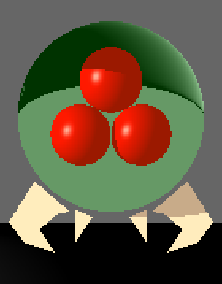

# Ray-Tracer
Trabalho feito para a disciplina de Computação Gráfica do curso de Ciências da Computação na UFC

Escolhi mostrar uma renderização simplificada de um Metroid como demonstração. O resultado foi o seguinte:

Fiz o trabalho seguindo como base os seguintes materiais:

- Como fazer uma janela no XCode: https://www.youtube.com/watch?v=Tz0dq2krCW8

- Teoria básica (1): http://www.inf.puc-rio.br/~asouza/FCG/tracadoderaios.html

- Teoria básica (2): http://disciplinas.ist.utl.pt/leic-cg/textos/livro/Shading.pdf

- Teoria básica (3): http://webserver2.tecgraf.puc-rio.br/~abraposo/INF1366/2005/13_raytracing.pdf

- Teoria básica (4): https://www.inf.pucrs.br/~pinho/CG/Aulas/Iluminacao/Ilumina.html

- Como fazer um raytracer (1): https://www.youtube.com/watch?v=RIgc5J_ZGu8

- Como fazer um raytracer (2): https://www.youtube.com/watch?v=k_aRiYSXcyo
